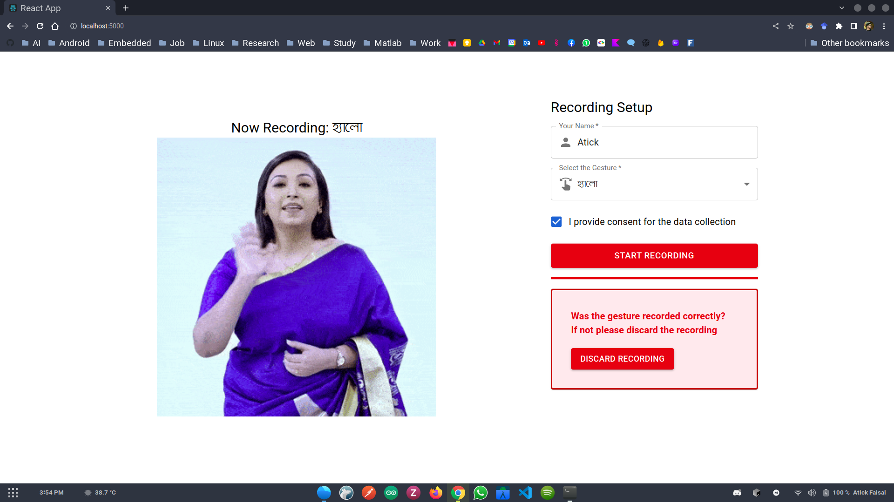

<h1 align="center">
BDSL Dataset Creator
<p>

</p>
</h1>
<h3 align="center">Video Dataset Creation Tool for Dynamic Bangla Sign Language Gestures</h3>

<p align="center">
    <a href="https://github.com/atick-faisal/BDSL-Dataset-Generation/releases"></a>
    <a href="https://github.com/atick-faisal/BDSL-Dataset-Generation/issues"></a>
    <a href="https://github.com/atick-faisal/BDSL-Dataset-Generation/contributors"></a>
</p>

<p align="center">
  
</p>

### How To Install
1. Download the .zip archive and extract
2. Install `Flask` and `open-cv`

```
  pip install flask
  pip install opencv-python
```
4. Move into the folder and run `server.py`

### How To Use
1. Enter your name
2. Select a gesture from the dropdown list
3. Prepare for performing the gesture by watching the guide
4. Hit "Start Recording" and perform the gesture withing 4 secs
5. Made a mistake? Press "Discard Recording" and repeat step 4

<p align="center"></p>
<p align="center"><a href="https://sites.google.com/view/mchowdhury" target="_blank">Qatar University Machine Learning Group</a>
<p align="center"><a href="https://github.com/catppuccin/catppuccin/blob/main/LICENSE"></a></p>
